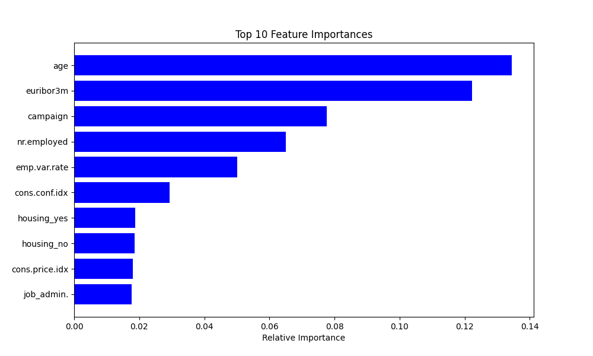
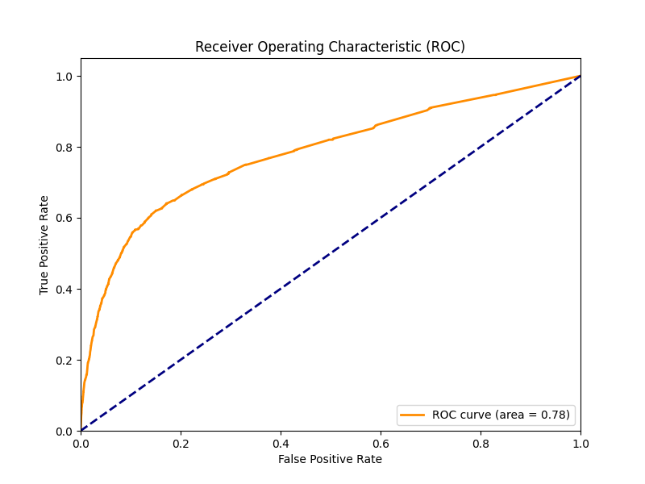

# 🏦 Predictive Lead Scoring System (Bank Marketing)


## 📋 Project Overview
Repositori ini berisi dokumentasi dan kode sumber *Machine Learning* untuk **Capstone Project Tim A25-CS083**. Proyek ini bertujuan untuk membangun solusi cerdas yang dapat memprediksi keberhasilan telemarketing perbankan (Deposito Berjangka).

Dengan menganalisis data historis nasabah, model ini dirancang untuk mengidentifikasi **"Hot Leads"** (nasabah potensial) dan memberikan **Skor Prioritas**. Hal ini memungkinkan tim sales untuk memprioritaskan panggilan mereka, meningkatkan efisiensi waktu, dan menaikkan *Conversion Rate*.

### Informasi Program
*   **Program:** Studi Independen Bersertifikat.
*   **Mitra:** PT Dicoding Akademi Indonesia (Program ASAH)
*   **Role:** Machine Learning Engineer

---

## 👥 Team Members (A25-CS083)
Proyek ini dikerjakan secara kolaboratif oleh tim lintas fungsi:
*   **Ardli Kafi Murobby** - Machine Learning Engineer (Data Modeling)
*   **Jeremy Timothy Souk** - Machine Learning Engineer (Data Analysis)
*   **Yoga Permana Putra** - React & Back-End Developer
*   **M. Mardlian Nurofiq** - React & Back-End Developer
*   **Jose Gabriel Thendito** - React & Back-End Developer

---

## 📂 Dataset Information
Dataset bersumber dari **UCI Machine Learning Repository**: [Bank Marketing Data Set](https://archive.ics.uci.edu/dataset/222/bank+marketing).

*   **Total Data:** 41,188 baris data nasabah.
*   **Fitur:** 20 Atribut yang mencakup Demografis, Finansial, dan Indikator Sosial-Ekonomi.
*   **Target:** `y` (binary: 'yes'/'no').
*   **Kondisi Data:** Highly Imbalanced (~89% No : 11% Yes).

### ⚠️ Key Engineering Decision
Kami memutuskan untuk **MENGHAPUS** fitur `duration` (durasi panggilan) dari pemodelan.
> **Alasan:** Durasi panggilan tidak diketahui *sebelum* panggilan dilakukan. Menggunakannya akan menyebabkan *Data Leakage* dan membuat model bias (terlihat bagus di training tapi gagal di dunia nyata). Kami ingin membangun model yang realistis untuk *pre-call planning*.

---

## 🛠️ Tech Stack & Methodology
Proyek ini dikembangkan menggunakan **Python** dengan pendekatan **CRISP-DM**.

### Libraries Utama
*   `Pandas` & `NumPy`: Manipulasi data tabular.
*   `Scikit-learn`: Pipeline preprocessing, modeling, dan evaluasi.
*   `Faker`: Pembangkitan data simulasi (Nama & No. Telp Indonesia) untuk kebutuhan demo aplikasi.
*   `Matplotlib` & `Seaborn`: Visualisasi data.

### Architecture Pipeline
1.  **Data Preprocessing:**
    *   Handling 'unknown' values.
    *   **Data Enrichment:** Menambahkan data dummy (Nama/Telp) menggunakan library `Faker`.
    *   **Transformation:** `StandardScaler` untuk numerik & `OneHotEncoder` untuk kategorikal.
2.  **Modeling Strategy:**
    *   **Algoritma:** Random Forest Classifier (`n_estimators=100`).
    *   **Handling Imbalance:** Menggunakan teknik **Cost-Sensitive Learning** dengan parameter `class_weight='balanced'`.
3.  **Deployment:**
    *   Output model diekspor menjadi CSV terstruktur untuk diinjeksi ke Database Backend.

---

## 📊 Model Performance
Berdasarkan evaluasi pada Data Uji (20% Split), model menunjukkan performa yang solid untuk keperluan *ranking* prioritas nasabah:

| Metric | Score | Interpretasi |
| :--- | :--- | :--- |
| **ROC-AUC Score** | **0.7817** | Target > 0.75 tercapai. Model baik dalam membedakan nasabah potensial vs non-potensial. |
| **Accuracy** | **89.57%** | Akurasi global yang tinggi (meskipun pada data imbalance). |
| **Precision (Class 0)** | 0.91 | Sangat akurat dalam memprediksi nasabah yang akan menolak (menghemat waktu sales). |

### Visualisasi Evaluasi

| Feature Importance | ROC Curve |
| :---: | :---: |
|  |  |

---

## 🔌 Output Integration (API Contract)
Tim Machine Learning menyediakan output data final dalam format CSV/JSON yang disepakati bersama tim Back-End Developer. Berikut adalah struktur datanya:

| customer_id | nama | no_telp | skor_probabilitas | y_actual |
| :--- | :--- | :--- | :--- | :--- |
| 40574 | T. Virman Haryanti | +62-0335... | **1.00** | yes |
| 40419 | Dodo Mustofa | +62-0973... | **0.98** | yes |
| ... | ... | ... | ... | ... |

*Data ini memungkinkan Portal Web menampilkan daftar nasabah yang diurutkan dari skor tertinggi ke terendah.*

---

## 🚀 How to Run
Untuk menjalankan eksperimen ini di mesin lokal Anda:

1.  **Clone Repository**
    ```bash
    git clone https://github.com/ardlikafi/predictive-lead-scoring-for-banking-sales-machine-learning.git
    cd predictive-lead-scoring-for-banking-sales-machine-learning
    ```

2.  **Install Requirements**
    ```bash
    pip install -r requirements.txt
    ```

3.  **Run Notebook**
    Buka dan jalankan file di folder `notebooks/`:
    `Customer_Data_Modeling.ipynb`

---

**Disclaimer:**
Proyek ini merupakan bagian dari tugas akhir Program Studi Independen Bersertifikat (SIB).